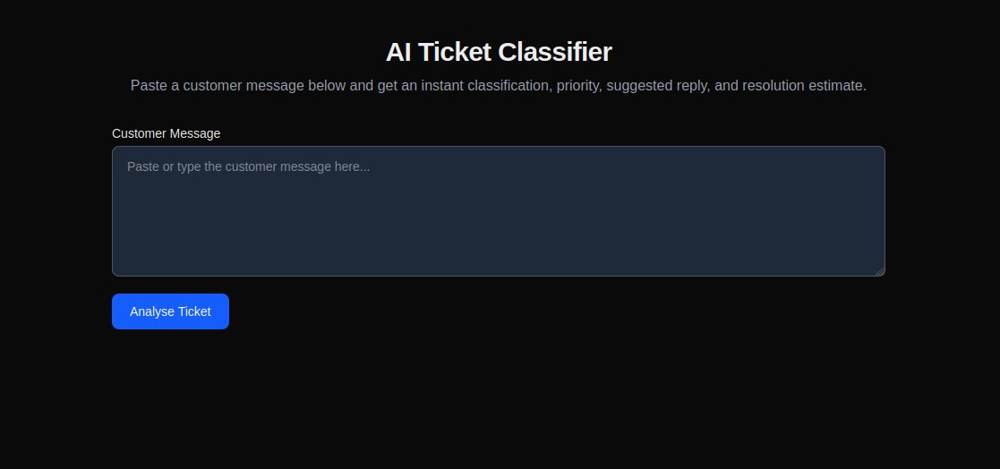
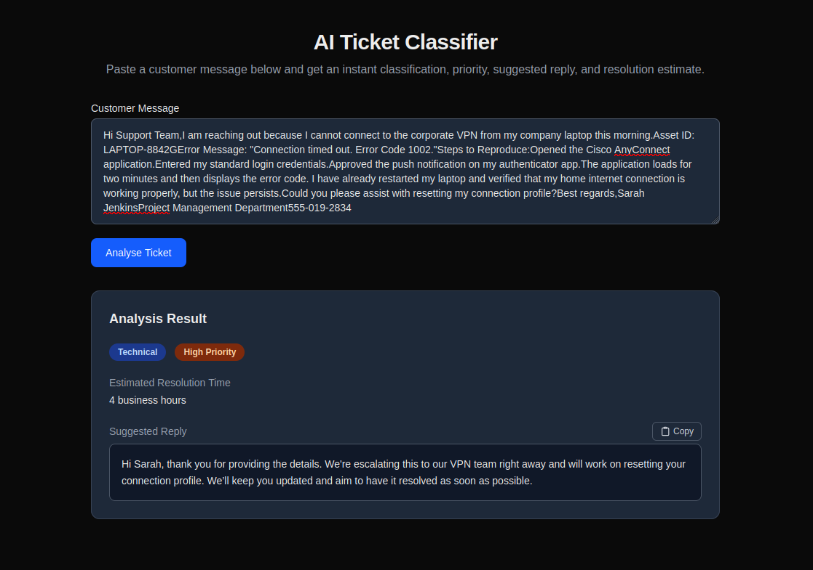
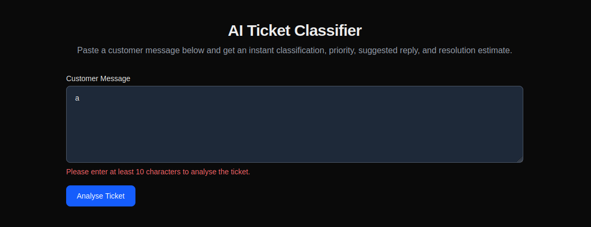

# AI-Ticket-Classifier
A Next.js based tool for ticket classification using natural language processing techniques.
This project uses a pre-trained LLMs to classify customer support tickets into different categories such as Billing, Technical, General Inquiry, Complaint, and Feature Request.
See Preview [here](#preview)

## Built With
- Next.js (Typescript)
- OpenRouter (free tier)
- TailwindCSS

## Features
- Automatic customer support ticket classification
- Assigning priority levels to tickets
- Estimated resolution time
- Suggested a one-line response for support agents

## Setup
1. Clone the repository
2. Install dependencies
    - `npm install` (or `yarn install` or `pnpm install`)
3. Configure environment variables
    - Create a `.env.local` file in the root directory
    - Add the following environment variables:
      - `OPENROUTER_API_KEY`: Your OpenRouter API key
      - `OPENROUTER_MODEL`: Choose a fee model from [OpenRouter](https://openrouter.ai/models?max_price=0&output_modalities=text)
4. Run the application
```bash
git clone https://github.com/hassanrazadev/ai-ticket-classifier.git
cd ai-ticket-classifier
npm install
npm run dev
```

## Usage
1. Open your browser and navigate to `http://localhost:3000`
2. Upload a customer support ticket
3. View the classification results

## Preview





## Contributing
1. Fork the repository
2. Create a new branch
3. Make your changes
4. Submit a pull request
